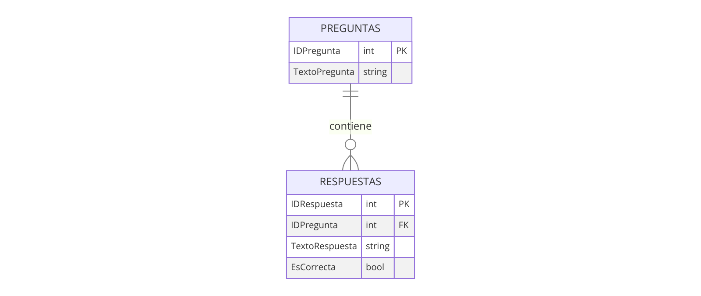

# Aplicación de Juego de Trivial en ASP.NET WebForms

## Descripción
Esta aplicación web desarrollada en VB.NET proporciona un entorno interactivo donde los usuarios pueden participar en un juego de trivial. Los jugadores responden preguntas seleccionadas al azar y reciben retroalimentación inmediata sobre sus respuestas.

## Entorno de Desarrollo
- **Framework**: .NET Framework 4.7.2
- **Front-end**: Bootstrap 4 para un diseño responsivo y estéticamente agradable.
- **Back-end**: VB.NET como lenguaje de programación.
- **Patrón de diseño**: Utiliza el patrón Repository para gestionar las operaciones de datos relacionadas con las preguntas y respuestas del juego.

## Estructura de la Base de Datos
La base de datos de la aplicación de Trivial utiliza un diseño entidad-relación para organizar cómo se almacenan las preguntas y respuestas. A continuación se muestra el diagrama entidad-relación que ilustra la estructura de la base de datos:

## Características
- **Interactividad**: Permite a los jugadores responder preguntas y ver instantáneamente si sus respuestas son correctas.
- **Gestión de preguntas**: Los administradores pueden agregar, editar y eliminar preguntas a través de un panel de administración.
- **Diseño responsivo**: Aprovecha Bootstrap para asegurar que la aplicación funcione bien en dispositivos de diferentes tamaños.

## Estructura de Archivos
- `Default.aspx`: Página principal que muestra las preguntas del juego y recoge respuestas de los usuarios.
- `Admin.aspx`: Página para la gestión de preguntas, accesible solo por los administradores.
- `App_Code/`: Contiene las clases de lógica de negocio y acceso a datos, implementando el patrón Repository.
  - `QuestionRepository.vb`: Clase que abstrae el acceso a las preguntas almacenadas en la base de datos.
- `Content/`: Directorio para archivos CSS y JavaScript.
  - `bootstrap/`: Carpeta que contiene los archivos de Bootstrap.
  - `custom.css`: Hoja de estilos personalizados para la aplicación.

## Configuración y Despliegue
1. Asegúrese de tener instalado el .NET Framework 4.8.
2. Clone el repositorio en su entorno local.
3. Abra el proyecto en Visual Studio.
4. Compile y ejecute la aplicación para asegurarse de que todas las dependencias están correctamente configuradas y que la base de datos es accesible.
5. Acceda a `Default.aspx` para comenzar a jugar.
